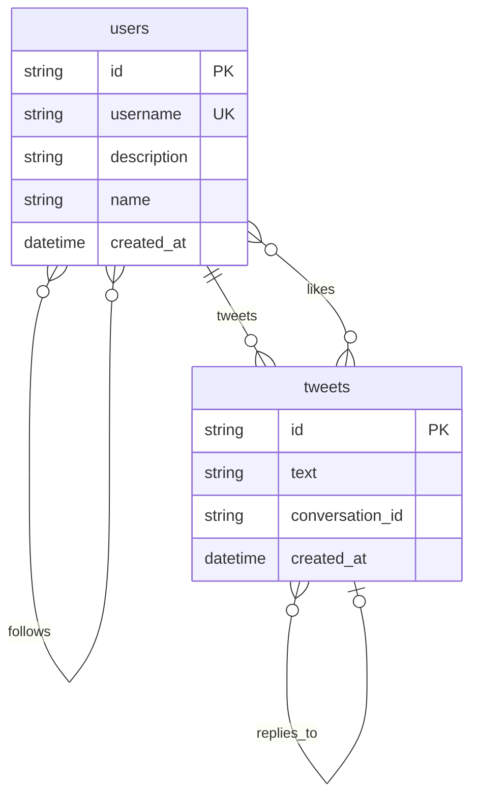

# Conceptual database design

```mermaid
erDiagram
    users 1--0+ tweets: tweets
    users 0+--0+ users: follows
    tweets 0+--zero or one tweets: replies_to
    users 0+--0+ tweets: likes

    users {
        string id PK
        string username UK
        string description
        string name
        datetime created_at
    }

    tweets {
        string id PK
        string text
        string conversation_id
        datetime created_at
    }

```